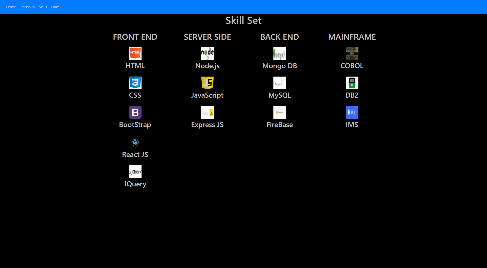

# jims_website

This is the start of my personal website

### Instrutions:

-   Just click on what you want to see

### Prerequisites

None.

### Installing

Installed using GitHub with following commands:

-   git clone (creates a dir for your github repo)
-   git add -A
-   git commit -m"comment goes here"
-   git push

## Running the tests

No automated testing

## Built With

-   HTML
-   CSS
-   Bootstrap

## Authors

-   **Jim Denis** - _Initial work_ - [JimDenis](https://github.com/JimDenis)

This app can be found on https://jimdenis.github.io/jims_website/
